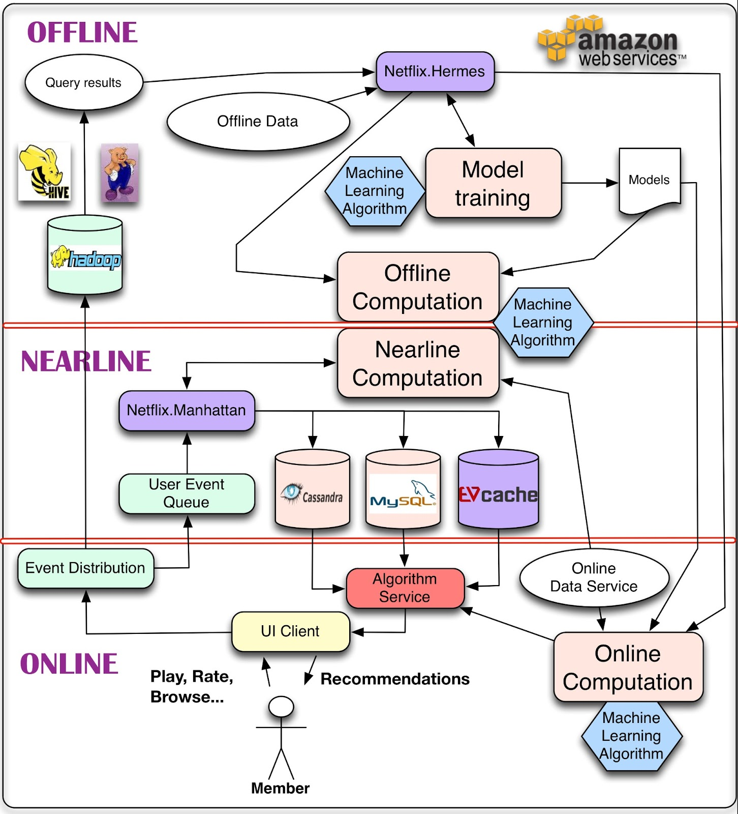

# SQL vs NoSQL

## SQL characteristics

* Data is stored in columns and tables.

* Relationships represented by data.

* DML and DDL.

* Transactions.

    * ACID properties.

* Abstraction from physical layer.

    * Declarative language.

    * Query optimization engine.

## Big data

* Extremely large datasets.

* Challenges:

    * Analysis, capture, searching, storage, transfer, visualization, querying, security.

* Characteristics: **volume**, **velocity** and **variety**.

* Big data **analytics**: capture and analysis processes aiming to find patterns and correlations in huge heterogeneous datasets.

### 3-layer hybrid architecture

1. Online processing:

    * Real-time data capture/processing.

    * Deals with **velocity**:

        * Algorithms need to be simple and fast.

2. Nearline processing:

    * Database-oriented.

    * Handles data storage and some processing *(slightly more complex than online processing)*.

3. Offline processing:

    * Batch heavy-processing of data.

#### Netflix architecture

### Lambda architecture

* Principles:
    
    1. **Human fault-tolerance**: data needs to survive human errors and hardware faults.

    2. **Data immutability**: no updates/deletes.

    3. **Recomputation**: recomputing previous results must always be possible.

* Levels: 

    1. **Batch layer**: stores the master dataset and computes **views** *(pre-computing)* using MapReduce algorithms.

    2. **Speed layer**: computes **real-time** views only with new data, not total data. Uses an **incremental model**. 

    3. **Serving layer**: output of the batch layer. Handles view indexing and provides views to the query system.

        * The query system uses both batch and speed views.

